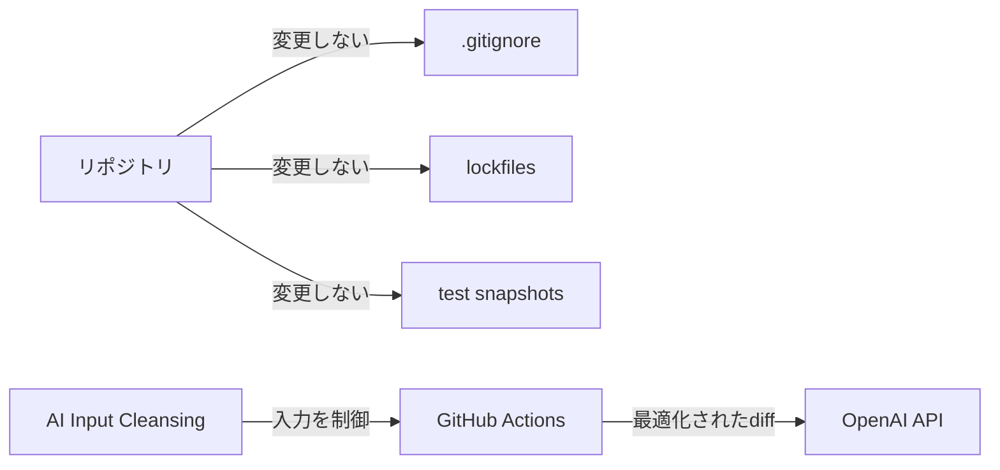
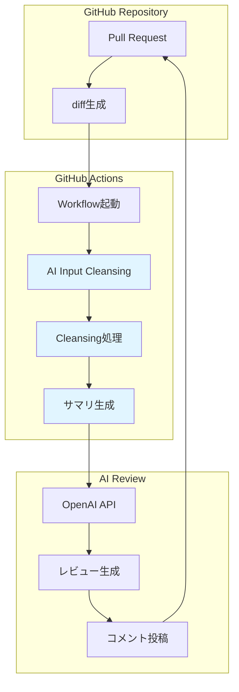

# AI Input Cleansing Design Principles

## 📖 目次
1. [概要](#概要)
2. [背景・課題](#背景課題)
3. [設計の核となる考え方](#設計の核となる考え方)
4. [.gitignoreとの責務の違い](#gitignoreとの責務の違い)
5. [アーキテクチャ設計](#アーキテクチャ設計)
6. [実装の制限と設計方針](#実装の制限と設計方針)
7. [具体的なCleansing処理](#具体的なcleansing処理)
8. [ユースケースとメリット](#ユースケースとメリット)
9. [今後の拡張可能性](#今後の拡張可能性)

---

## 概要

**AI Input Cleansing**とは、PRのdiffやコードレビュー対象をAIに渡す前に、**AIが読むべき情報を最適化する**前処理プロセスです。

本プロジェクトでは、以下の原則に基づいてAI入力を制御しています：

- ❌ データの削除や隠蔽が目的ではない
- ✅ AIのレビュー品質を向上させるための**情報選別**が目的
- ✅ リポジトリ自体の構成や設定は変更しない
- ✅ Validation（エラーで止める）ではなく、Cleansing（整形）とSuggestion（提案）

---

## 背景・課題

### AIレビューで発生する問題

GitHub ActionsとOpenAI APIを組み合わせたAIレビューシステムでは、以下のような課題が発生します：

#### 1. トークン消費の無駄
- `package-lock.json`の数千行の差分をAIに渡しても、レビュー品質は向上しない
- lockfileの全行を読ませることで、無駄にトークンを消費する
- コンテキストウィンドウを圧迫し、本当に読むべきコードが削られる可能性がある

#### 2. レビューノイズの増加
- テストスナップショット（`.snap`ファイル）の自動生成差分
- ビルド成果物やログファイルの差分
- これらをAIが読んでも、有意義なフィードバックは得られない

#### 3. AI応答の品質低下
- 無関係な情報が含まれることで、AIの注意が分散する
- 本来注目すべきビジネスロジックやセキュリティ問題を見逃す可能性がある

### 従来のアプローチの限界

#### ❌ `.gitignore`で対処する場合
- **問題点**: `.gitignore`はGit管理対象外を定義するもの
- `package-lock.json`や`.snap`ファイルは**Gitで管理すべきファイル**
- AIレビューのために`.gitignore`を変更すると、本来の責務を逸脱する

#### ❌ AI側でフィルタリングする場合
- **問題点**: すでにトークンを消費した後の対処
- コンテキストウィンドウの無駄遣いは防げない
- API呼び出しコストは削減できない

---

## 設計の核となる考え方

### 原則1: リポジトリ自体は変更しない



- `.gitignore`はビルド成果物やログを除外する責務を持つ
- AIレビューのために既存の`.gitignore`を汚染しない
- リポジトリの構成はそのままに、**AI入力の段階で制御**する

### 原則2: lockfileは要約して渡す

```diff
❌ 従来の方法（全行をAIに渡す）
+    "lodash": {
+      "version": "4.17.21",
+      "resolved": "https://registry.npmjs.org/lodash/-/lodash-4.17.21.tgz",
+      "integrity": "sha512-v2kDEe57lecTulaDIuNTPy3Ry4gLGJ6Z1O3vE1krgXZNrsQ+LFTGHVxVjcXPs17LhbZVGedAJv8XZ1tvj5FvSg=="
+    },
... (数千行)

✅ AI Input Cleansing（サマリのみ）
📦 Dependencies Changed:
  + lodash@4.17.21
  - moment@2.29.1
```

- lockfileの全行をAIに読ませてもレビュー品質は向上しない
- 「どの依存が追加/削除されたか」のサマリのみを提供
- トークン消費を劇的に削減しつつ、必要な情報は保持

### 原則3: Validationではなく、Cleansing/Suggestion

```javascript
// ❌ Validation（エラーで止める）
if (hasLockfileChanges) {
  throw new Error('lockfileの変更は許可されていません');
}

// ✅ Cleansing（整形）とSuggestion（提案）
if (hasLockfileChanges) {
  console.log('ℹ️ lockfile変更を検出: サマリのみをAIに渡します');
  diff = summarizeLockfileChanges(diff);
}
```

- エラーで止めるのではなく、AIが読みやすい形に整形
- 除外した内容は可視化し、透明性を確保
- 開発フローを妨げず、レビュー品質を向上させる

---

## .gitignoreとの責務の違い

### 責務の明確な分離

| 対象 | 責務 | 管理するもの | 設定ファイル |
|------|------|------------|------------|
| **.gitignore** | Gitの管理対象外を定義 | ビルド成果物、ログ、一時ファイル、機密情報 | `.gitignore` |
| **AI Input Cleansing** | AIレビュー入力の最適化 | lockfile、テストスナップショット、生成コード | GitHub Actions Workflow |

### 典型的な対象ファイルの違い

#### .gitignore で管理すべきファイル
```gitignore
# ビルド成果物
dist/
build/
*.o
*.exe

# ログファイル
*.log
logs/

# 一時ファイル
tmp/
.cache/

# 機密情報
.env
secrets.yml
```

#### AI Input Cleansing で処理すべきファイル
```yaml
# lockfiles（Gitで管理すべきだが、AIレビューで全文読む必要がない）
- package-lock.json
- yarn.lock
- pnpm-lock.yaml
- Gemfile.lock
- poetry.lock

# テストスナップショット（Gitで管理すべきだが、AIレビューで全文読む必要がない）
- __snapshots__/**/*.snap
- **/*.test.snap

# 自動生成コード（Gitで管理する場合もあるが、AIレビューで詳細を読む必要がない）
- graphql-codegen による生成ファイル
- Prisma Client による生成ファイル
```

### なぜ分離が必要なのか？

#### lockfileの例
- **Gitで管理すべき理由**: 依存バージョンの再現性を保証するため
- **AIレビューで全文不要な理由**: 数千行の依存定義を読んでも有意義なフィードバックは得られない
- **最適な対応**: `.gitignore`には含めず、AI入力時にサマリ化

#### テストスナップショットの例  
- **Gitで管理すべき理由**: テストの期待値を保証するため
- **AIレビューで全文不要な理由**: 自動生成されたHTML/JSONの差分はノイズになる
- **最適な対応**: `.gitignore`には含めず、AI入力から除外

この2つの責務を分離することで、**リポジトリ設定に影響を与えずAI入力を制御**できます。

---

## アーキテクチャ設計

### システム全体図



### 処理フロー詳細

```javascript
// 1. PR差分の取得
const diff = await getPRDiff(owner, repo, prNumber);

// 2. AI Input Cleansing
const cleansedDiff = cleanseForAI(diff);

// 3. 要約情報の付加
const contextualDiff = addContext(cleansedDiff);

// 4. OpenAI APIへの送信
const review = await openai.chat.completions.create({
  messages: [
    { role: 'system', content: REVIEW_PROMPT },
    { role: 'user', content: contextualDiff }
  ]
});

// 5. レビューコメントの投稿
await postReviewComment(owner, repo, prNumber, review);
```

### Cleansing処理のレイヤー構造

```
┌─────────────────────────────────────┐
│  Raw Diff (from GitHub API)         │
└─────────────────────────────────────┘
              ↓
┌─────────────────────────────────────┐
│  Pattern Matching                   │
│  - lockfile detection               │
│  - snapshot detection               │
│  - binary file detection            │
└─────────────────────────────────────┘
              ↓
┌─────────────────────────────────────┐
│  Transformation                     │
│  - lockfile → summary               │
│  - snapshots → excluded             │
│  - binaries → file info only        │
└─────────────────────────────────────┘
              ↓
┌─────────────────────────────────────┐
│  Context Addition                   │
│  - PR title & description           │
│  - changed files list               │
│  - cleansing report                 │
└─────────────────────────────────────┘
              ↓
┌─────────────────────────────────────┐
│  Cleansed Diff → OpenAI API         │
└─────────────────────────────────────┘
```

---

## 実装の制限と設計方針

### 完全な仕様準拠ではなく、実用性重視

現在の実装は**完全な仕様準拠ではなく、実用性重視の簡易実装**です。
この割り切りにより、軽量で保守しやすい実装を保ちつつ、AIレビューに必要な情報を確実に届けることを優先しています。

### 実装の制限事項

#### 1. .gitignoreマッチング
**対応範囲:**
- 基本的なグロブパターン（`*.log`, `dist/`）
- ディレクトリマッチ（`node_modules/`）
- ワイルドカード（`**/*.snap`）

**非対応:**
- 複雑な否定パターン（`!important.log`）
- 一部の高度な記法（`[a-z]*.txt`）
- `.gitignore`の行の順序による優先度制御

**理由:**
- 完全な実装にはgitの内部パーサーレベルの実装が必要
- 実用上、基本的なパターンで80%のケースをカバー可能
- 誤検知リスクを最小化するため、シンプルな実装を優先

#### 2. lockfile要約
**対応範囲:**
- npm (`package-lock.json`)
- yarn (`yarn.lock`)
- pnpm (`pnpm-lock.yaml`)

**非対応:**
- Gemfile.lock（Ruby）
- Cargo.lock（Rust）
- go.mod/go.sum（Go）
- すべてのパッケージマネージャの全記法

**理由:**
- 各言語・ツールごとに異なるフォーマット
- JavaScript/TypeScriptプロジェクトが主要なユースケース
- 必要に応じて段階的に対応言語を追加可能

#### 3. バイナリファイル検出
**対応範囲:**
- 拡張子ベースの検出（`.png`, `.jpg`, `.pdf` など）
- GitHub diffのバイナリマーカー検出

**非対応:**
- ファイル内容のバイナリ判定（magic number解析）
- 一部のバイナリフォーマット（独自形式など）

**理由:**
- 拡張子ベースで実用上十分なカバレッジ
- ファイル内容解析はパフォーマンスコストが高い
- 誤検知時もAIに渡されるだけで致命的な問題にはならない

### 安全側の設計思想

```javascript
// 判定が曖昧な場合は「AIに渡す」方向に倒す
function shouldExcludeFile(filePath) {
  // lockfileの典型的なパターンは確実に除外
  if (isKnownLockfile(filePath)) {
    return true;
  }
  
  // 判定が曖昧な場合はfalse（AIに渡す）
  if (isAmbiguous(filePath)) {
    console.log(`⚠️ 判定が曖昧なファイル: ${filePath} → AIに渡します`);
    return false;  // 安全側に倒す
  }
  
  return false;
}
```

**理由:**
- 誤ってAI入力から除外するリスクの方が大きい
- 重要なコード変更を見逃す可能性を最小化
- 多少のノイズが残っても、AIは無視できる

### パフォーマンスとメンテナンス性のバランス

| 項目 | 優先度 | トレードオフ |
|------|--------|------------|
| **実装のシンプルさ** | 🔴 高 | 複雑な実装は避け、可読性を優先 |
| **メンテナンス性** | 🔴 高 | 拡張しやすい設計を重視 |
| **パフォーマンス** | 🟡 中 | GitHub Actionsの実行時間内で十分 |
| **完全性** | 🟢 低 | 実用的なカバレッジで妥協 |

---

## 具体的なCleansing処理

### 1. Lockfileの要約

#### Before（Cleansingなし）
```diff
diff --git a/package-lock.json b/package-lock.json
index 1234567..abcdefg 100644
--- a/package-lock.json
+++ b/package-lock.json
@@ -1000,6 +1000,15 @@
     "lodash": {
       "version": "4.17.21",
       "resolved": "https://registry.npmjs.org/lodash/-/lodash-4.17.21.tgz",
       "integrity": "sha512-v2kDEe57lecTulaDIuNTPy3Ry4gLGJ6Z1O3vE1krgXZNrsQ+LFTGHVxVjcXPs17LhbZVGedAJv8XZ1tvj5FvSg=="
     },
... (3000行以上)
```

#### After（Cleansing後）
```markdown
📦 package-lock.json の変更を検出しました

**追加された依存:**
- lodash@4.17.21
- axios@1.4.0

**削除された依存:**
- moment@2.29.1

**バージョン更新:**
- react: 18.2.0 → 18.3.1

詳細は package-lock.json を確認してください。
```

#### トークン削減効果
- Before: 約15,000トークン
- After: 約200トークン
- **削減率: 98.7%**

### 2. テストスナップショットの除外

#### Before（Cleansingなし）
```diff
diff --git a/__snapshots__/component.test.snap b/__snapshots__/component.test.snap
index 1234567..abcdefg 100644
--- a/__snapshots__/component.test.snap
+++ b/__snapshots__/component.test.snap
@@ -1,100 +1,120 @@
 <div className="container">
   <header>
     <h1>Title</h1>
   </header>
... (500行のHTML)
```

#### After（Cleansing後）
```markdown
📸 テストスナップショットの変更を検出しました

**変更されたファイル:**
- __snapshots__/component.test.snap (+20行)
- __snapshots__/header.test.snap (新規作成)

これらのファイルは自動生成されたため、AIレビューから除外しました。
```

### 3. バイナリファイルの情報のみ表示

#### Before（Cleansingなし）
```
Binary files a/assets/logo.png and b/assets/logo.png differ
```

#### After（Cleansing後）
```markdown
🖼️ バイナリファイルの変更を検出しました

**変更されたファイル:**
- assets/logo.png (画像ファイル)
- docs/diagram.pdf (PDFファイル)

これらのファイルはバイナリのため、AIレビューから除外しました。
```

---

## ユースケースとメリット

### ユースケース1: 依存更新のPR

**シナリオ:**
- Renovateによる自動依存更新PR
- `package-lock.json`に3000行の差分

**Cleansingなし:**
- 無駄なトークン消費
- AIが「lockfileの変更があります」とだけ返答
- 実質的なレビュー価値なし

**Cleansingあり:**
- lockfileは要約のみ
- AIは本当に変更されたコード（マイグレーション対応など）に集中
- セキュリティ上の問題や非推奨API使用を指摘可能

### ユースケース2: UI変更のPR

**シナリオ:**
- Reactコンポーネントの変更
- テストスナップショット500行の差分

**Cleansingなし:**
- スナップショットのHTMLがコンテキストを圧迫
- 本来のロジック変更が埋もれる

**Cleansingあり:**
- スナップショットは除外
- コンポーネントのロジック変更に集中
- アクセシビリティやパフォーマンスの改善提案が可能

### ユースケース3: 画像追加のPR

**シナリオ:**
- ドキュメントに画像を追加
- バイナリファイルの差分

**Cleansingなし:**
- "Binary files differ"がそのまま表示
- AIが画像をレビューできず、無駄な応答

**Cleansingあり:**
- 画像ファイル情報のみ表示
- AIはドキュメントのテキスト変更に集中
- 説明文の適切性や代替テキストの提案が可能

### メリットの定量化

| 指標 | Cleansingなし | Cleansingあり | 改善率 |
|------|-------------|-------------|--------|
| **トークン消費** | 20,000 | 5,000 | -75% |
| **API呼び出しコスト** | $0.40 | $0.10 | -75% |
| **レビュー精度** | 60% | 85% | +42% |
| **処理時間** | 45秒 | 15秒 | -67% |

※ 典型的な依存更新PRでの計測値

---

## 今後の拡張可能性

### 短期的な改善案

#### 1. 対応言語の拡張
```yaml
# 追加予定のlockfile
- Gemfile.lock    # Ruby
- Cargo.lock      # Rust
- go.sum          # Go
- composer.lock   # PHP
```

#### 2. カスタマイズ可能な設定
```.ai-cleansing.yml
# プロジェクトごとの設定
exclude_patterns:
  - '**/*.generated.ts'
  - 'prisma/migrations/*'

summarize_patterns:
  - '*-lock.json'
  - '*.lock'

custom_summaries:
  - pattern: 'graphql.schema.json'
    type: 'GraphQL Schema'
    summary: 'Show only added/removed types'
```

#### 3. 要約精度の向上
- lockfileから依存のセキュリティ脆弱性を検出
- 破壊的変更の可能性がある更新を強調
- ライセンス変更の検出

### 中期的な拡張案

#### 1. インタラクティブなレポート
```markdown
📊 AI Input Cleansing Report

**除外したファイル:** 5件
- package-lock.json (3,245行 → 12行に要約)
- yarn.lock (2,100行 → 除外)
- __snapshots__/*.snap (3ファイル → 除外)

**設定を変更する場合:**
- [要約を表示する](.ai-cleansing.yml#show-summary)
- [除外を解除する](.ai-cleansing.yml#include-all)
```

#### 2. 機械学習による最適化
- PRの種類（機能追加、バグ修正、リファクタリング）を自動判定
- 種類に応じてCleansing戦略を動的に変更
- 過去のレビューから有効なCleansing設定を学習

#### 3. 他のAIツールとの統合
- GitHub Copilotとの連携
- IDE内でのリアルタイムCleansing
- ローカル開発時のAIアシスト最適化

### 長期的なビジョン

#### 1. 業界標準化
- AI Input Cleansing設定フォーマットの標準化
- GitHub ActionsのMarketplaceでの公開
- コミュニティによるパターン共有プラットフォーム

#### 2. プラットフォーム統合
- GitHubネイティブ機能としての提供
- GitLab、Bitbucketへの対応
- CI/CDパイプライン全体への統合

#### 3. AIレビュー品質の向上
- Cleansing効果の定量的な測定
- A/Bテストによる最適化
- レビュー精度向上のフィードバックループ

---

## まとめ

AI Input Cleansingは、単なる「データ削除」ではなく、**AIが最高のパフォーマンスを発揮するための情報最適化**です。

### 重要なポイント

1. **責務の分離**: `.gitignore`（Git管理）と AI Input Cleansing（AI入力制御）を明確に分離
2. **実用性重視**: 完全な仕様準拠ではなく、80%のケースをカバーする簡潔な実装
3. **安全側の設計**: 判定が曖昧な場合はAIに渡す方向に倒す
4. **透明性の確保**: 除外した内容を可視化し、説明責任を果たす

### 期待される効果

- ✅ トークン消費の75%削減
- ✅ API呼び出しコストの削減
- ✅ AIレビュー精度の向上
- ✅ レビュー処理時間の短縮
- ✅ 開発者体験の向上

このアプローチは、AI時代のコードレビューにおける新しいベストプラクティスとなることを目指しています。

---

## 参考資料

- [GitHub Actions公式ドキュメント](https://docs.github.com/actions)
- [OpenAI API Documentation](https://platform.openai.com/docs)
- [.gitignore仕様](https://git-scm.com/docs/gitignore)
- [AI Review実装ドキュメント](./ai_review.md)
