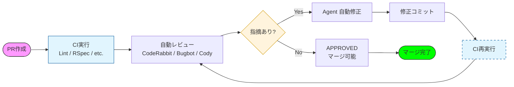

```mermaid
graph LR
    PR([PR作成]) --> CI1[CI実行<br/>Lint / RSpec / etc.]
    
    CI1 --> AR[自動レビュー<br/>CodeRabbit / Bugbot / Cody]
    
    AR --> Review{指摘あり?}

    Review -- Yes --> Agent[Agent 自動修正]
    Agent --> Commit[修正コミット]
    Commit --> CI2[CI再実行]
    
    %% 再実行からレビューへ
    CI2 --> AR

    Review -- No --> Approved[APPROVED<br/>マージ可能]
    Approved --> Merged([マージ完了])

    %% スタイリングでメリハリを
    style PR fill:#f9f,stroke:#333
    style CI1 fill:#e1f5fe,stroke:#01579b
    style CI2 fill:#e1f5fe,stroke:#01579b,stroke-dasharray: 5 5
    style Review fill:#fff4dd,stroke:#d4a017
    style Merged fill:#00ff00,stroke:#333


```

> [!NOTE]
> 出典: 『Software Design 2025年12月号』p.130 木下雄一郎 著 「AI時代のコードレビュー」掲載の図を参考に作成。

