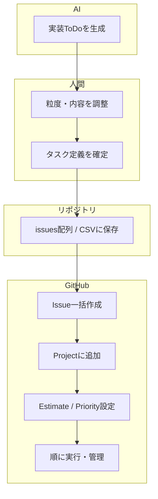

# gh CLI を用いた Issue 一括生成・Project 自動登録スクリプト

## 概要
本スクリプトは、GitHub CLI（`gh`）を用いて **複数の Issue を一括で作成**し、作成した Issue を **GitHub Projects（v2）へ自動で追加**、あわせて **Estimate / Priority といった Project のカスタムフィールドを自動設定**するための Bash スクリプトです。

Issue 作成、Project 登録、フィールド入力を一連の処理として自動化することで、プロジェクト立ち上げ時の初期作業を効率化することを目的としています。

## スクリプト
- [Issue一括生成スクリプト](../scripts/create_issues_and_project_items.sh)
---

## 背景・目的
GitHub Projects を用いたタスク管理では、

- Issue を1件ずつ作成する
- Project に追加する
- Estimate や Priority を手動で設定する

といった作業が発生します。  
これらを手作業で行うと、時間がかかるだけでなく、入力漏れや設定ミスが起こりやすくなります。

そこで本スクリプトでは、**CLI ベースでこれらの操作をまとめて自動化**し、再現性のある形でタスク初期化を行えるようにしました。

---

## 主な機能
- `gh issue create` による Issue の一括作成
- `gh project item-add` による Project への自動紐付け
- Project の数値フィールド（Estimate）の自動設定
- Project の単一選択フィールド（Priority）の自動設定
- Field 名や選択肢名ではなく **内部 ID を取得して操作**することで、確実にフィールドを更新

---

## 使い方（簡易）
1. スクリプト冒頭で `OWNER`（Organization / ユーザー名）と `PROJECT_NUMBER` を指定  
2. `issues` 配列に、作成したい Issue の情報（タイトル / 本文 / Estimate / Priority）を定義  
3. スクリプトを実行すると、Issue 作成から Project 登録、フィールド設定までが自動で行われます

---

## 工夫した点
- GitHub Projects（v2）の仕様に合わせ、Project / Field / Option の **内部 ID を事前に取得**してから操作している
- Issue 作成後に返却される URL / item_id を用いて、処理を一貫して紐付けている
- Issue 定義を配列として持たせることで、タスク一覧をコードとして管理できるようにしている

---

## 現時点での成果
- GitHub CLI と Projects（v2）を組み合わせた **実用的な自動化スクリプト**を作成できた
- Issue 管理と Project 管理を分断せず、一連の流れとして扱えるようになった
- プロジェクト初期構築時の作業時間を大幅に削減できる見通しが立った

---

## 今後の改善・実装予定
現時点では基本機能の実装を優先していますが、今後以下の改善を検討しています。

- OWNER / PROJECT_NUMBER の指定方法を分かりやすくする補助説明の追加
- 同一 Issue の二重作成を防ぐための事前チェック処理
- Issue 定義を CSV / TSV ファイルから読み込む形式への拡張（区切り文字問題の回避、表形式管理への対応）

---

## 補足1：GitHub Copilot を用いた Issue 作成との位置づけ

現在は GitHub Copilot を利用して、自然言語の指示から Issue を作成することも可能です。  
例えば、GitHub 上で Copilot に対して「このプロジェクトのタスクを Issue として作成してほしい」といった指示を行うことで、Issue のタイトルや本文を自動生成できます。

GitHub Copilot による Issue 作成は、

- Issue 内容のたたき台を素早く作れる
- 人間が考えた要件を自然言語でそのまま渡せる

といった点で非常に有効です。

一方で、本スクリプトは以下の点に主眼を置いています。

- 複数 Issue を **再現性のある形で一括生成**できる
- Issue 作成後の **Project 追加・フィールド設定（Estimate / Priority）までを自動化**できる
- タスク定義をコードとして管理でき、後から同じ構成を再実行できる

そのため、  
**Copilot による Issue 内容生成**と  
**本スクリプトによる Project 運用の自動化**は、競合するものではなく、用途に応じて使い分け・併用できるものと考えています。

### 参考ドキュメント
- [GitHub Copilot 公式ドキュメント（Issue 作成・活用方法）  ](https://docs.github.com/ja/copilot/how-tos/use-copilot-for-common-tasks/use-copilot-to-create-or-update-issues)

---

## 補足2：AIにToDoを作らせて、そのままIssue / Projectに落とす運用

AIに実装を依頼する前段として、まず「この変更を完了するためのToDo（手順・タスク）」を生成させ、  
そのToDoを `gh` CLI を用いて Issue 化し、GitHub Projects に自動登録する運用も想定しています。

### 想定フロー
1. AIに対して「この機能を実装するためのToDoリスト（Issue粒度）」を生成させる  
2. 必要に応じて人間が粒度・表現を軽く調整する  
3. ToDoリストを `issues` 配列（または CSV / TSV）として定義する  
4. 本スクリプトを実行し、Issue 作成・Project 登録・フィールド設定を一括で行う  
5. Project 上の Issue を上から順に実行し、進捗を管理する  

### この運用の利点
- AIによる **設計・タスク分解（計画）** と、GitHub Projects による **実行管理** を分断せずに接続できる
- Issue / Project の初期状態（Estimate / Priority）を揃えたまま運用を開始できる
- AIが生成したタスク案を、**コード（配列 / CSV）として固定化**することで、再現性のあるプロジェクト初期化が可能になる
- 同じ構成のタスクセットを、別リポジトリや別プロジェクトでも再利用できる

このスクリプトは、単なる Issue 作成の自動化ではなく、  
**AIが考え、人間が確認し、GitHubが実行を管理する** という役割分担を前提とした運用フローの土台として位置づけています。

