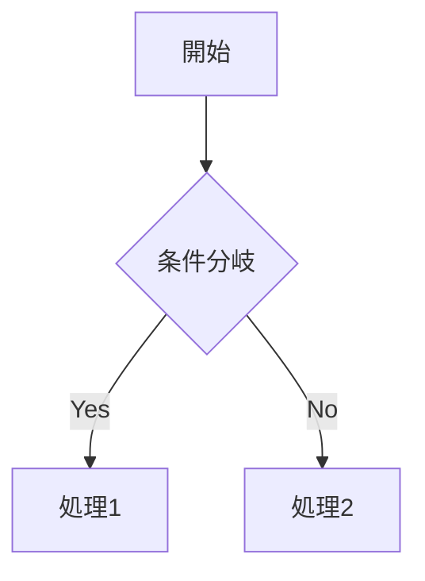

# GitHub Markdown 装飾機能 完全ガイド

GitHubのMarkdownファイル（`.md`）で使用可能な全ての装飾・書式機能をまとめました。サンプルファイルも作成しましたので、そのまま活用いただけます。

## 装飾機能一覧

GitHubでは**GitHub Flavored Markdown (GFM)** という拡張Markdown記法を採用しており、標準のMarkdownに加えて多くの便利な機能が使えます [^11][^14]。

### 基本的なテキスト装飾

| 機能 | 記法 | 表示例 |
|:-----|:-----|:-------|
| 太字 | `**テキスト**` または `__テキスト__` | **太字** |
| イタリック | `*テキスト*` または `_テキスト_` | *イタリック* |
| 取り消し線 | `~~テキスト~~` | ~~取り消し~~ |
| 太字+イタリック | `***テキスト***` | ***両方*** |
| 下付き文字 | `<sub>テキスト</sub>` | H₂O |
| 上付き文字 | `<sup>テキスト</sup>` | x² |
| 下線 | `<ins>テキスト</ins>` | 下線付き |

[^11]

### 見出し (Headings)

`#` の数で見出しレベル（H1〜H6）を指定します [^11]。


# 見出し1
## 見出し2
### 見出し3
#### 見出し4
##### 見出し5
###### 見出し6


### リスト

**箇条書きリスト**: `-`、`*`、`+` のいずれかで作成 [^11]
```markdown
- 項目1
- 項目2
  - ネストした項目
```

**番号付きリスト**: 数字とピリオドで作成
```markdown
1. 最初
2. 2番目
```

**タスクリスト（チェックボックス）**: `- [ ]` で未完了、`- [x]` で完了 [^11]
```markdown
- [x] 完了したタスク
- [ ] 未完了のタスク
```

### コードブロック

**インラインコード**: バッククォートで囲む
```markdown
`git status` でステータスを確認
```

**コードブロック（シンタックスハイライト）**: 三連バッククォート + 言語名 [^25][^28]
````markdown
```ruby
def hello
  puts "Hello, World!"
end
```
````

対応言語は Ruby、JavaScript、Python、Go、Rust、SQL など多数あります。

### テーブル

パイプ（`|`）とハイフン（`-`）で表を作成します [^24][^30]。

```markdown
| 左揃え | 中央揃え | 右揃え |
|:-------|:--------:|-------:|
| データ | データ | データ |
```

`:` の位置で揃え方を指定できます。

### 引用

`>` で引用文を作成します [^11]。

```markdown
> 引用文です
>> 多重引用も可能
```

### アラート（Callouts）

5種類のアラートが利用可能です [^7][^11]。


> [!NOTE]
> 補足情報

> [!TIP]
> 便利なヒント

> [!IMPORTANT]
> 重要な情報

> [!WARNING]
> 警告

> [!CAUTION]
> 注意が必要な操作


### 脚注


本文中に脚注を挿入[^1]。

[^1]: 脚注の内容


脚注はページ下部にまとめて表示されます。ただしWikiでは非対応です [^11]。

### 折りたたみセクション

`<details>` と `<summary>` タグを使用します [^16][^19]。


<details>
<summary>クリックして展開</summary>

ここに詳細な内容を記述
- リストも使える
- コードブロックも使える

</details>


### 数式（LaTeX/MathJax）

GitHubは MathJax を使用した数式表示に対応しています [^17][^23]。

**インライン数式**: `$E = mc^2$`

**ブロック数式**:

$$
x = \frac{-b \pm \sqrt{b^2-4ac}}{2a}
$$


または：

```math
\int_0^\infty e^{-x^2} dx = \frac{\sqrt{\pi}}{2}
```


### Mermaid ダイアグラム

フローチャート、シーケンス図、ガントチャート、円グラフ、クラス図などを作成できます [^18][^21]。





対応するダイアグラム：
- Flowchart（フローチャート）
- Sequence Diagram（シーケンス図）
- Gantt Chart（ガントチャート）
- Class Diagram（クラス図）
- State Diagram（状態遷移図）
- Pie Chart（円グラフ）
- Git Graph（Gitグラフ）

### リンク・画像

**リンク**:

[表示テキスト](URL)
[GitHub](https://github.com "タイトル付き")


URLは自動的にリンクになります（自動リンク機能）[^34]。

**画像**:
```markdown

```

### 絵文字

`:絵文字コード:` の形式で絵文字を挿入できます [^11]。

```markdown
:smile: :+1: :heart: :rocket: :tada:
```

### キーボードキー（kbd）

```markdown
<kbd>Ctrl</kbd> + <kbd>C</kbd> でコピー
```

キーボードショートカットを見やすく表示できます [^26][^29]。

### 水平線

3つ以上の `---`、`***`、`___` で水平線を挿入します [^32]。

```markdown
---
```

### エスケープ

特殊文字をそのまま表示するにはバックスラッシュ `\` を使用します [^33]。

```markdown
\*アスタリスクをそのまま表示\*
\# シャープをそのまま表示
```

### コメント（非表示テキスト）

```markdown
<!-- このテキストは表示されません -->
```

### カラーモデル（Issues/PR/Discussions限定）

バッククォート内に色コードを書くと色が可視化されます [^11]。

```markdown
`#ff5733`
`rgb(255, 87, 51)`
`hsl(14, 100%, 60%)`
```

※ファイル内では使用不可

### メンション・参照

```markdown
@username でユーザーをメンション
#123 で Issue/PR を参照
```

---

## 機能対応表

| 機能 | ファイル | Issues | PR | Wiki |
|:-----|:--------:|:------:|:--:|:----:|
| 基本書式 | ✅ | ✅ | ✅ | ✅ |
| テーブル | ✅ | ✅ | ✅ | ✅ |
| タスクリスト | ✅ | ✅ | ✅ | ✅ |
| 脚注 | ✅ | ✅ | ✅ | ❌ |
| アラート | ✅ | ✅ | ✅ | ✅ |
| 数式 | ✅ | ✅ | ✅ | ✅ |
| Mermaid | ✅ | ✅ | ✅ | ✅ |
| カラーモデル | ❌ | ✅ | ✅ | ❌ |

[^7]

---

## サンプルファイル

上記の全機能を実際に試せるサンプルMarkdownファイルを作成しました。GitHubリポジトリにアップロードすると、全ての装飾が適用された状態で確認できます。


---

## 参考リンク

- [GitHub Docs: Basic writing and formatting syntax](https://docs.github.com/ja/get-started/writing-on-github/getting-started-with-writing-and-formatting-on-github/basic-writing-and-formatting-syntax)
- [GitHub Flavored Markdown Spec](https://github.github.com/gfm/)
- [Mermaid Documentation](https://mermaid.js.org/)


---

## References

7. [GitHub.com で利用可能な Markdown 記法を知りたい - Qiita](https://qiita.com/Yarakashi_Kikohshi/items/8b1ebfa798a35dec6154) - GitHub.com で利用可能な主な Markdown 記法は GitHub Flavored Markdown (GFM) という仕様に従っています。しかし、GitHub.com では GFM 以...

11. [基本的な書き込みと書式設定の構文 - GitHub ドキュメント](https://docs.github.com/ja/get-started/writing-on-github/getting-started-with-writing-and-formatting-on-github/basic-writing-and-formatting-syntax) - GitHub で簡単な構文を使用して、散文とコードの高度な書式設定を作成します。

14. [Markdown記法 完全ガイド【基本から応用（CommonMark・GFM ...](https://askthewind.hatenablog.com/entry/sample-markdown-page/) - このページでは CommonMark および GitHub Flavored Markdown (GFM) の基本構文に加え、主要な拡張構文の書き方についても紹介しています。 なお ...

16. [セクションを折りたたんで情報を整理する - GitHub ドキュメント](https://docs.github.com/ja/get-started/writing-on-github/working-with-advanced-formatting/organizing-information-with-collapsed-sections) - 折りたたみセクションの作成. 閲覧者が希望により展開できる、折りたたみセクションを作成して、Markdown のセクションを一時的に隠すことができます。

17. [GitHubがMarkdown内で数式表記をサポート、TeX/LaTeX構文で記述](https://www.publickey1.jp/blog/22/githubmarkdowntexlatex.html) - GitHubはMarkdownで記述するドキュメント内で、TeXおよびLaTeX構文で記述する数式の表記をサポートすると発表しました。

18. [GitHubでMermaid構文の表示機能が強化されていました](https://dev.classmethod.jp/articles/github-mermaid-markdown-cntrol/) - Mermaid構文を利用することにより、次のような図をMarkdownで記述することができます。 Flowchart; Sequence Diagram; Gantt Chart; Class Dia...

19. [GitHubのREADMEなどマークダウンで折り畳み表示を行う](https://monomonotech.jp/kurage/memo/m220330_github_markdown_details.html) - details>. details タグで囲みます。 ▷ の横の文字列は summary タグで囲みます。 ちなみに、中にインラインコードやリストなどのmarkdownを書いても ...

21. [GitHub、Markdown構文でフローチャートやクラス図、ガント ...](https://www.publickey1.jp/blog/22/githubmarkdownmermaid.html) - GitHub、Markdown構文でフローチャートやクラス図、ガントチャートなどのダイアグラムを表示できる「Mermaid」をサポート開始. 2022年2月17日. GitHubは ...

23. [数式の記述 - GitHub ドキュメント](https://docs.github.com/ja/get-started/writing-on-github/working-with-advanced-formatting/writing-mathematical-expressions) - 数式を明確に伝えるために、GitHub は、Markdown 内で LaTeX 形式の数式をサポートしています。 詳細については、Wikibooks の「LaTeX/Mathematics」を参照して...

24. [Markdown形式を使用してGitHubでテーブルを作成](https://qiita.com/yusuke62/items/31711f3be7799c7774f4) - Markdown形式では、パイプ記号（|）とハイフン（-）を使用して、表の列と行を定義します。 （-）を使用すると、その上のセルは中央揃えになります。 ※（:）を追加 ...

25. [[GitHub] Markdownの「シンタックスハイライト」に対応している ...](https://blog.katsubemakito.net/articles/github-markdown-syntaxhighlighting) - 今回はGitHubが対応しているカラーシンタックスの設定一覧をまとめておきます。 ハイライトのやり方; GitHubで利用できる言語一覧. 定義; 一覧. おまけ.

26. [[小ネタ][GitHub] コメントでキー入力を表現するときに使えるタグ](https://dev.classmethod.jp/articles/github-comment-tag-kbd/) - この書き方は Markdown の記法としては存在しないため、調べるのに少し苦労しました。 キー入力を表現したい場合は <kbd> タグで囲ってみてください。

28. [[GitHub] コードブロックでシンタックスハイライト可能な言語一覧](https://dev.classmethod.jp/articles/syntax-highlight-language-list/) - ここで 開始の三連バッククォートの後 にその言語に対するキーワードを記述すると、コードブロックでシンタックスハイライトが有効になります。

29. [キーボードショートカットの正しいマークアップ #GitHub - Qiita](https://qiita.com/ygkn/items/0b485f6aedd15eadec33) - Qiitaでは（というより多くのMarkdown記法では） <kbd> はサポートされていませんのでHTMLで書く必要があります。 例：. Copied! <kbd><kbd>Ctrl</kbd>+<...

30. [Markdown記法 チートシート](https://gist.github.com/mignonstyle/083c9e1651d7734f84c99b8cf49d57fa) - Table 表. - と | を使ってtableを作成します。 | TH1 | TH2 | ----|---- | TD1 | TD3 | | TD2 | TD4 |. TH1, TH2. TD1, ...

32. [Markdown: 水平線・横線・区切り線を引く <hr> - ITガイド](https://step-learn.com/article/markdown/md-hr.html) - Markdownで水平線（横線・区切り線） <hr> を入れるには、 *（アスタリスク）、-（ハイフン）、_（アンダースコア） のどれかを3つ以上並べます。

33. [Markdownで特殊文字をエスケープしてそのまま表示する方法](https://gizanbeak.com/post/markdown-escape) - Markdownで特殊文字をエスケープするには バックスラッシュ（ \ ） を特殊文字の前に入力すればOKです。 例えば、HTMLの<a>タグをそのまま表示したい場合は以下のように記述 ...

34. [Markdown の URL 自動リンクと CommonMark と GitHub Flavored ...](https://hidakatsuya.dev/2021/02/14/markdown-and-commonmark-and-ghm.html) - 前述の自動リンクを解決する方法を調べた結果、GitHub Pages の _config.yml を次のように変更することで実現できることがわかった。 + markdown: ...

