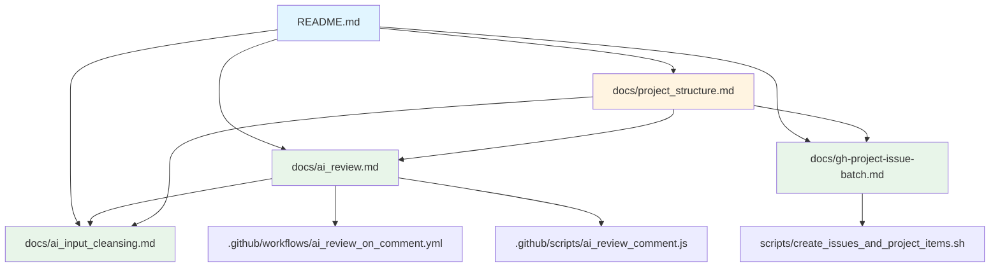

# プロジェクト構成ガイド

## 📖 目次
1. [プロジェクト概要](#プロジェクト概要)
2. [ディレクトリ構造](#ディレクトリ構造)
3. [各ファイルの詳細説明](#各ファイルの詳細説明)
4. [関連ドキュメント](#関連ドキュメント)
5. [セットアップ手順](#セットアップ手順)
6. [使用技術とツール](#使用技術とツール)

---

## プロジェクト概要

このプロジェクトは、**GitHub ActionsとAIを活用した開発プロセスの自動化**を実現するサンプルプロジェクトです。

### 主な機能

1. **AI PRレビュー**: Pull Requestに対してOpenAI APIを使った自動レビュー
2. **Issue一括管理**: GitHub CLIを使ったIssueの一括作成とProject管理
3. **AI Input Cleansing**: AIレビューの品質向上のための入力最適化

### 想定利用シーン

- チーム開発におけるコードレビューの効率化
- プロジェクト立ち上げ時のタスク管理自動化
- 研修や教育目的でのGitHub Actions実装例の学習

---

## ディレクトリ構造

```
github-issues-sample/
├── README.md                           # プロジェクトの概要とクイックスタート
├── docs/                               # ドキュメント集
│   ├── ai_input_cleansing.md          # AI入力最適化の設計原則（詳細版）
│   ├── ai_review.md                   # AIレビュー機能の実装ガイド
│   ├── gh-project-issue-batch.md      # Issue一括管理の解説
│   └── project_structure.md           # 本ドキュメント（プロジェクト構成）
├── scripts/                            # 自動化スクリプト
│   └── create_issues_and_project_items.sh  # Issue一括作成スクリプト
└── .github/                            # GitHub Actions設定（想定）
    ├── workflows/
    │   └── ai_review_on_comment.yml   # AIレビューワークフロー
    └── scripts/
        └── ai_review_comment.js       # AIレビュー処理スクリプト
```

---

## 各ファイルの詳細説明

### 📄 ルートディレクトリ

#### README.md
**役割**: プロジェクトのエントリーポイント

**内容:**
- プロジェクトの簡潔な説明
- クイックスタートガイド
- 各ドキュメントへのリンク

**対象読者:**
- 初めてこのプロジェクトに触れる開発者
- 全体像を把握したい人

**メンテナンス方針:**
- 詳細な設計説明は `docs/` に分離
- 頻繁に更新される内容は含めない
- 常に最新のプロジェクト概要を反映

---

### 📁 docs/

ドキュメント専用ディレクトリ。各機能の詳細な設計、実装方針、使い方をまとめています。

#### ai_input_cleansing.md
**役割**: AI Input Cleansingの設計思想と実装詳細

**主な内容:**
- 設計の核となる考え方
- `.gitignore`との責務の違い
- アーキテクチャ設計
- 実装の制限と設計方針
- 具体的なCleansing処理
- ユースケースとメリット
- 今後の拡張可能性

**対象読者:**
- AIレビュー機能を導入したい開発者
- AI入力最適化の設計を理解したい人
- 研修でAI活用のベストプラクティスを学びたい人

**参照元:**
- [README.md](../README.md) - 簡潔な概要として引用
- [ai_review.md](./ai_review.md) - 実装との連携

**メンテナンス方針:**
- 設計思想の変更があれば更新
- 新しいユースケースが見つかれば追加
- コミュニティからのフィードバックを反映

---

#### ai_review.md
**役割**: AIレビュー機能の実装ガイド

**主な内容:**
- AIレビュー機能の概要
- 全体構成とファイル配置
- 処理フロー
- セキュリティ設計
- セットアップ手順
- トラブルシューティング

**対象読者:**
- AIレビューを実際に導入する開発者
- GitHub Actionsの実装を学びたい人
- OpenAI APIの活用例を知りたい人

**技術スタック:**
- GitHub Actions
- OpenAI API (Responses API)
- Node.js / JavaScript
- GitHub REST API

**関連ファイル:**
- `.github/workflows/ai_review_on_comment.yml` - ワークフロー定義
- `.github/scripts/ai_review_comment.js` - レビュー処理ロジック

**メンテナンス方針:**
- OpenAI APIの仕様変更に追従
- 実装上の問題が見つかれば修正
- セキュリティベストプラクティスの更新

---

#### gh-project-issue-batch.md
**役割**: GitHub CLIを使ったIssue一括管理の解説

**主な内容:**
- Issue一括作成の概要と目的
- GitHub Projects（v2）との連携
- スクリプトの使い方
- カスタムフィールド（Estimate / Priority）の設定
- GitHub Copilotによる代替手法との比較

**対象読者:**
- プロジェクト立ち上げ時のタスク初期化を効率化したい人
- GitHub CLIの活用方法を学びたい人
- GitHub Projectsの自動化に興味がある人

**技術スタック:**
- GitHub CLI (`gh`)
- Bash Script
- GitHub Projects (v2) API

**関連ファイル:**
- `scripts/create_issues_and_project_items.sh` - 実装本体

**メンテナンス方針:**
- GitHub CLI / Projects APIの仕様変更に追従
- より便利な使い方が見つかれば追加
- コミュニティからの改善提案を反映

---

#### project_structure.md（本ドキュメント）
**役割**: プロジェクト全体の構成と各ファイルの関係性を説明

**主な内容:**
- ディレクトリ構造
- 各ファイルの役割と内容
- ファイル間の依存関係
- セットアップ手順
- メンテナンス方針

**対象読者:**
- プロジェクトの全体像を理解したい人
- 新しいメンバーのオンボーディング
- ドキュメント構成を参考にしたい人

**メンテナンス方針:**
- ファイル追加・削除時に必ず更新
- ディレクトリ構造が変わったら即座に反映
- 四半期ごとに全体の整合性を確認

---

### 📁 scripts/

自動化スクリプトを格納するディレクトリ。

#### create_issues_and_project_items.sh
**役割**: Issueの一括作成とGitHub Projectsへの自動登録

**主な機能:**
1. 複数のIssueを配列定義から一括作成
2. 作成したIssueを指定したProjectに自動追加
3. Estimate（数値）とPriority（選択肢）を自動設定
4. Project / Field / Optionの内部IDを自動取得

**使用方法:**
```bash
# スクリプト冒頭で設定
OWNER="your-org-or-username"
PROJECT_NUMBER=1

# 実行
chmod +x scripts/create_issues_and_project_items.sh
scripts/create_issues_and_project_items.sh
```

**前提条件:**
- `gh` コマンドがインストール済み
- `gh auth login` で認証済み
- `jq` がインストール済み
- 対象のProjectに `Estimate` (Number) と `Priority` (Single select) フィールドが存在
- Priorityの選択肢として P0 / P1 / P2 が存在

**Issue定義フォーマット:**
```bash
issues=(
  "タイトル:本文:見積:優先度"
  "[Issue 1] 機能実装:詳細な説明:3:P1"
  "[Issue 2] バグ修正:修正内容:1:P0"
)
```

**エラーハンドリング:**
- `set -euo pipefail` でエラー時に即座に停止
- 事前チェックで `gh` / `jq` の存在確認
- OWNER / PROJECT_NUMBER の未設定を検出
- Field IDが取得できない場合は警告を表示

**詳細ドキュメント:**
- [gh-project-issue-batch.md](./gh-project-issue-batch.md)

---

### 📁 .github/（想定）

GitHub Actions関連の設定ファイルを格納するディレクトリ。
※ 本リポジトリでは実装済みを想定していますが、ディレクトリ構造には含まれていません。

#### .github/workflows/ai_review_on_comment.yml
**役割**: AIレビューのワークフロー定義

**トリガー:**
- `issue_comment` イベント
- コメントが `/ai-review` で始まる
- コメント投稿者が `User`（Botを除外）

**処理内容:**
1. PR情報の取得
2. `ai_review_comment.js` の実行
3. レビュー結果のPRへの投稿

**環境変数:**
- `OPENAI_API_KEY`: OpenAI APIキー（Secrets）
- `AI_REVIEW_PAT`: GitHub Personal Access Token（Secrets）

**詳細ドキュメント:**
- [ai_review.md](./ai_review.md)

---

#### .github/scripts/ai_review_comment.js
**役割**: AIレビューの処理ロジック

**主な機能:**
1. GitHub APIからPR差分を取得
2. AI Input Cleansingの適用
3. OpenAI APIへのレビュー依頼
4. レスポンスの整形（コードフェンス対策）
5. PRへのコメント投稿

**依存ライブラリ:**
- `@octokit/rest`: GitHub API クライアント
- `openai`: OpenAI API クライアント

**Cleansing処理の例:**
```javascript
function cleanseForAI(diff) {
  // lockfileの検出と要約
  if (isLockfile(filePath)) {
    return summarizeLockfile(diff);
  }
  
  // スナップショットの除外
  if (isSnapshot(filePath)) {
    return excludeSnapshot(filePath);
  }
  
  // バイナリファイルの情報のみ表示
  if (isBinary(filePath)) {
    return showBinaryInfo(filePath);
  }
  
  return diff;
}
```

**詳細ドキュメント:**
- [ai_review.md](./ai_review.md)
- [ai_input_cleansing.md](./ai_input_cleansing.md)

---

## 関連ドキュメント

### ドキュメント間の依存関係



### 読む順序の推奨

#### 初めての人
1. [README.md](../README.md) - プロジェクト概要を把握
2. [project_structure.md](./project_structure.md)（本ドキュメント） - 全体構成を理解
3. 興味のある機能のドキュメントを読む

#### AIレビューを導入したい人
1. [ai_review.md](./ai_review.md) - 実装方法を理解
2. [ai_input_cleansing.md](./ai_input_cleansing.md) - 設計思想を理解
3. `.github/workflows/ai_review_on_comment.yml` - 実装例を確認

#### Issue管理を自動化したい人
1. [gh-project-issue-batch.md](./gh-project-issue-batch.md) - 機能を理解
2. `scripts/create_issues_and_project_items.sh` - スクリプトを確認
3. 自分のプロジェクトに合わせてカスタマイズ

---

## セットアップ手順

### 前提条件

#### 必須ツール
- Git
- GitHub CLI (`gh`)
- Node.js 18以上（AIレビュー機能を使う場合）
- jq（Issue一括作成を使う場合）

#### GitHub権限
- リポジトリの管理者権限
- GitHub Actions の有効化
- Secrets の設定権限

### 1. リポジトリのクローン

```bash
git clone https://github.com/your-org/github-issues-sample.git
cd github-issues-sample
```

### 2. GitHub CLIの認証

```bash
gh auth login
```

### 3. AIレビュー機能のセットアップ

#### 3.1 OpenAI API Keyの取得
1. [OpenAI Dashboard](https://platform.openai.com/) でAPI Key発行
2. GitHub Repo → Settings → Secrets → Actions
3. `OPENAI_API_KEY` として登録

#### 3.2 GitHub PATの作成
1. GitHub → Settings → Developer settings → Personal access tokens
2. Classic Token を作成（scope: `repo`）
3. Repo Secrets に `AI_REVIEW_PAT` として登録

#### 3.3 ワークフローファイルの配置
```bash
mkdir -p .github/workflows
mkdir -p .github/scripts

# ワークフローファイルとスクリプトを配置
# （実装済みの場合はスキップ）
```

#### 3.4 動作確認
1. Pull Requestを作成
2. コメントに `/ai-review` を入力
3. AIレビューが投稿されることを確認

**詳細:** [ai_review.md](./ai_review.md#セットアップ手順)

### 4. Issue一括作成機能のセットアップ

#### 4.1 スクリプトの編集
```bash
# scripts/create_issues_and_project_items.sh を編集
OWNER="your-org-or-username"  # 自分のOrg/ユーザー名
PROJECT_NUMBER=1               # ProjectのNumber
```

#### 4.2 Issue定義の編集
```bash
issues=(
  "[Issue 1] タスク1:説明1:3:P1"
  "[Issue 2] タスク2:説明2:5:P0"
  # 必要なIssueを追加
)
```

#### 4.3 実行
```bash
chmod +x scripts/create_issues_and_project_items.sh
scripts/create_issues_and_project_items.sh
```

**詳細:** [gh-project-issue-batch.md](./gh-project-issue-batch.md#使い方)

---

## 使用技術とツール

### コア技術

| 技術 | バージョン | 用途 |
|------|----------|------|
| **GitHub Actions** | - | CI/CDとワークフロー自動化 |
| **GitHub CLI** | 2.x以上 | Issue/Projects操作 |
| **Node.js** | 18以上 | AIレビュースクリプト実行環境 |
| **Bash** | 4.x以上 | Issue一括作成スクリプト |

### ライブラリ・API

| 名前 | 用途 | ドキュメント |
|------|------|------------|
| **OpenAI API** | AIレビュー生成 | [公式ドキュメント](https://platform.openai.com/docs) |
| **GitHub REST API** | PR差分取得、コメント投稿 | [公式ドキュメント](https://docs.github.com/rest) |
| **GitHub Projects API** | Issue登録、フィールド設定 | [公式ドキュメント](https://docs.github.com/graphql) |
| **@octokit/rest** | GitHub API クライアント（Node.js） | [npm](https://www.npmjs.com/package/@octokit/rest) |
| **openai (Node.js SDK)** | OpenAI API クライアント | [npm](https://www.npmjs.com/package/openai) |
| **jq** | JSON処理（Bashスクリプト） | [公式サイト](https://jqlang.github.io/jq/) |

### 開発ツール

| ツール | 用途 |
|--------|------|
| **VS Code** | 推奨エディタ |
| **GitHub Desktop** | Git GUI（オプション） |
| **Postman** | API動作確認（オプション） |

---

## トラブルシューティング

### よくある問題と解決方法

#### Q1: AIレビューが動作しない
**確認事項:**
- `OPENAI_API_KEY` が正しく設定されているか
- `AI_REVIEW_PAT` のスコープが `repo` になっているか
- コメントが `/ai-review` で始まっているか
- PRに差分が存在するか

**解決方法:**
[ai_review.md](./ai_review.md) のトラブルシューティングセクションを参照

---

#### Q2: Issue一括作成が失敗する
**確認事項:**
- `gh auth status` で認証状態を確認
- `OWNER` と `PROJECT_NUMBER` が正しいか
- Project に `Estimate` / `Priority` フィールドが存在するか
- `jq` がインストールされているか

**解決方法:**
```bash
# 認証状態の確認
gh auth status

# jqのインストール（macOS）
brew install jq

# Projectの確認
gh project list --owner $OWNER
```

---

#### Q3: ドキュメントの内容が古い
**対応方法:**
- Issueを作成して報告
- Pull Requestで修正を提案
- Discussionsで質問

---

## メンテナンスガイドライン

### ドキュメント更新のルール

#### 必ず更新が必要なケース
- ファイル/ディレクトリの追加・削除・リネーム
- 機能の追加・廃止
- APIの仕様変更
- セキュリティ上の重要な変更

#### 推奨される更新タイミング
- 新機能のリリース時
- バグ修正のマージ時
- ユーザーからのフィードバック受領時
- 四半期ごとの定期レビュー

### ドキュメントの品質基準

#### 必須項目
- 目的と対象読者の明記
- 具体的な手順やコード例
- トラブルシューティング
- 最終更新日

#### 推奨項目
- 図表やダイアグラム
- 関連ドキュメントへのリンク
- 実際のユースケース
- パフォーマンスや制限事項

---

## まとめ

このプロジェクトは、以下の要素で構成されています：

### ドキュメント体系
- **README.md**: エントリーポイント
- **docs/**: 詳細なドキュメント集
- **コメント**: コード内の説明

### 自動化機能
- **AIレビュー**: PR品質向上
- **Issue管理**: タスク初期化効率化
- **AI Input Cleansing**: レビュー最適化

### 技術スタック
- **GitHub Actions**: CI/CD
- **GitHub CLI**: 自動化
- **OpenAI API**: AI機能
- **Node.js / Bash**: スクリプト

この構成により、**学習しやすく、拡張しやすく、メンテナンスしやすい**プロジェクトを実現しています。

---

## 次のステップ

### 初心者向け
1. [README.md](../README.md) を読んで全体像を把握
2. AIレビューまたはIssue管理のどちらかを試す
3. 実際のプロジェクトに適用

### 中級者向け
1. 設計ドキュメントを読んで理念を理解
2. スクリプトをカスタマイズ
3. 新機能の追加を検討

### 上級者向け
1. AI Input Cleansingの拡張
2. 他のAIサービスとの統合
3. コミュニティへの貢献

---

**最終更新**: 2026年1月30日
